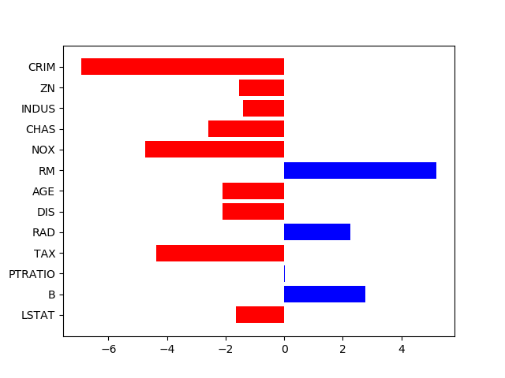

# Explainability

Here is a notebook I did to try to work with explainability of a neural network. I worked with the Boston Housing dataset which is a regression based on 13 quantitative features. I used a code found on Kaggle for the prediction part (https://www.kaggle.com/shanekonaung/boston-housing-price-dataset-with-keras). I tried to "explain" the modele prediction by approximating the derivatives of each feature (on a single individual). For each individual we obtain something like this :

